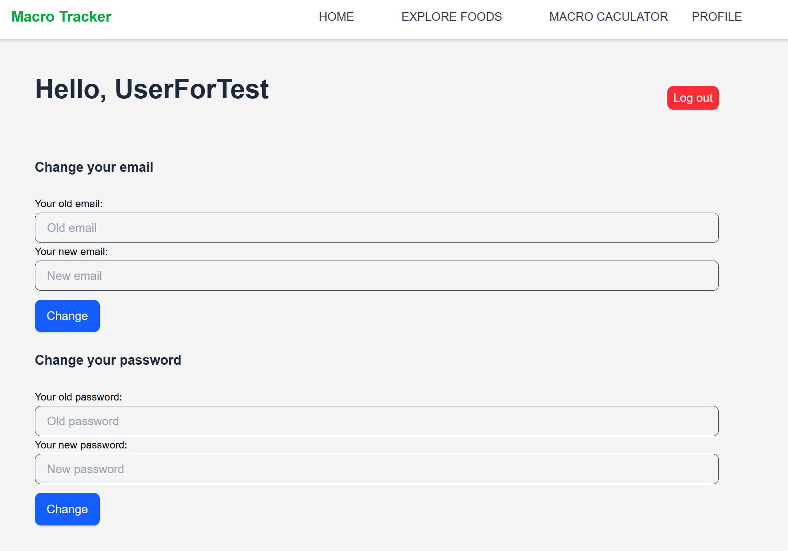
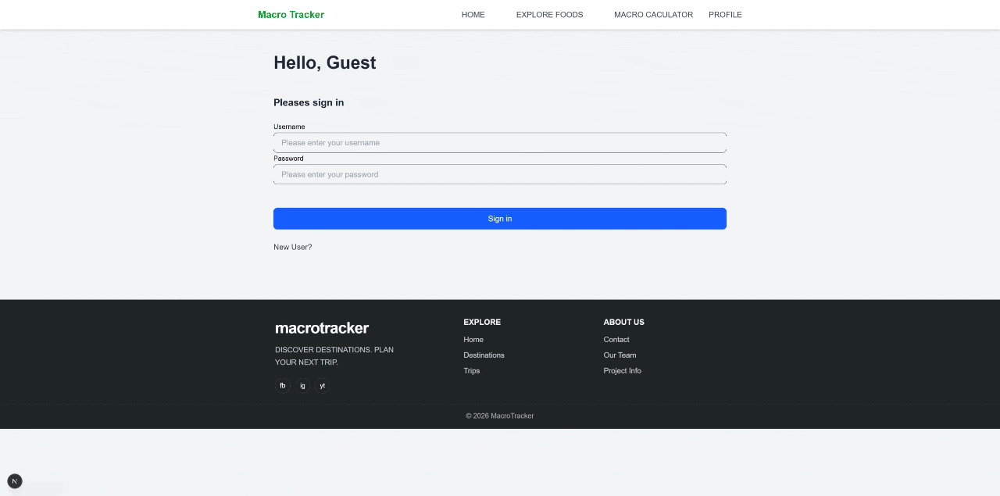
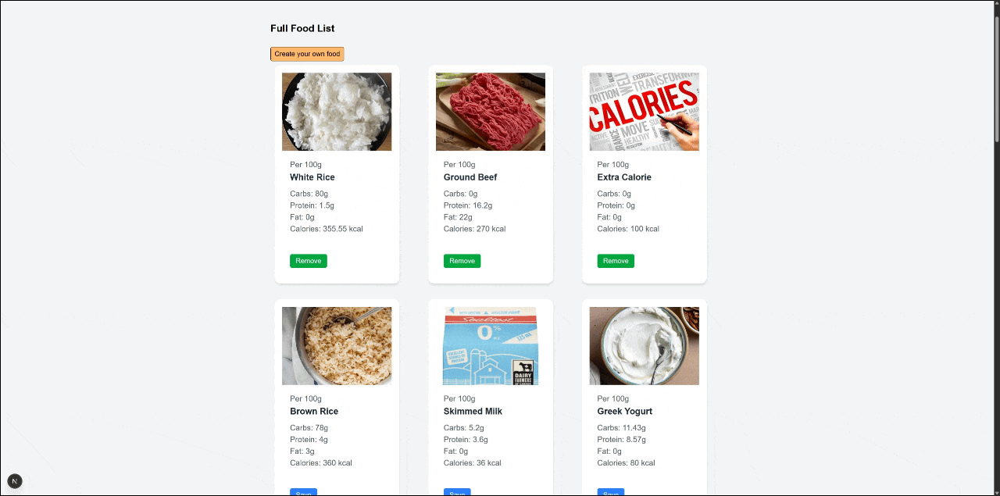

# MacroTracker

[](https://github.com/Alex11205/Macro/actions/workflows/backend-ci.yaml)

[](https://github.com/Alex11205/Macro/actions/workflows/frontend-ci.yaml)

MacroTracker is a deployed full-stack macronutrition tracking application focused on secure backend REST API development, relational data modeling, automated testing, GitHub Actions CI, and production deployment.

Live Production: [View Site](https://macro-xi-lime.vercel.app)

API Documentation: [Swagger UI Endpoint](https://macro-production-b20a.up.railway.app/swagger-ui/index.html)

## Why I Built It

Tracking daily calories and macronutrients can be repetitive and error-prone. MacroTracker provides a centralized application for managing foods, recording daily intake, creating custom foods and monitoring nutritional targets.

## Screenshots & GIFs

User Profile:



Login:



Tracking Foods:



## Engineering Highlights

- Stateless JWT authentication with USER and ADMIN authorization
- BCrypt password hashing and validated DTO-based request handling
- Centralized exception handling with consistent error responses and application logging with SLF4J
- PostgreSQL persistence with Spring Data JPA and versioned Liquibase migrations
- Unit, controller slice, Testcontainers repository, integration, and E2E testing
- Automated backend and frontend verification through GitHub Actions
- OpenAPI/Swagger API documentation
- Independently deployed frontend and backend services

## Features

- User registration and login
- Custom food creation and browsing
- Personal favorite food management
- Daily macro tracking with automated caloric breakdown
- Email and password updates
- User management for ADMINs


## Tech Stack

### Backend
- Java 21
- Spring Boot 4
- Spring Security
- Spring Data JPA
- PostgreSQL
- Liquibase
- Testcontainers
- JUnit 5 / Mockito
- springdoc-openapi

### Frontend
- Next.js
- React
- TypeScript/JavaScript
- Playwright smoke test
- Tailwind CSS

### DevOps
- Docker Compose
- GitHub Actions CI
- Liquibase database version control
- Documentation: OpenAPI/Swagger

### Hosting
- Frontend: Vercel
- Backend: Railway

## Architecture

The backend currently uses a layered structure:

- `controller`
- `service`
- `repository`
- `model`
- `dto`
- `security`
- `exceptions`
- `config`

```text
+---src
|   +---main
|   |   +---java
|   |   |   \---com
|   |   |       \---alex
|   |   |           \---macro
|   |   |               +---config
|   |   |               +---controller
|   |   |               +---dto
|   |   |               +---exceptions
|   |   |               +---model
|   |   |               +---repository
|   |   |               +---security
|   |   |               \---service
|   |   \---resources
|   |       +---db
|   |       |   \---changelog
|   |       |       \---changes
|   |       +---static
|   |       \---templates
|   \---test
|       +---java
|       |   \---com
|       |       \---alex
|       |           \---macro
|       |               +---controller
|       |               +---e2e
|       |               +---integration
|       |               +---repository
|       |               \---service
|       \---resources
\---pom.xml
```

## API Documentation

- [Production Swagger UI](https://macro-production-b20a.up.railway.app/swagger-ui/index.html)
- [Production OpenAPI Specification](https://macro-production-b20a.up.railway.app/v3/api-docs)
- Local Swagger UI: `http://localhost:8080/swagger-ui/index.html`

## Local Setup
Follow these steps to get a local development environment running on your machine.

### Prerequisites
- Java 21
- Maven
- Docker Desktop
- Node.js 24
- npm

### Setup Backend

Clone this repository and navigate to the backend directory

```bash
git clone https://github.com/Alex11205/Macro.git
cd Macro/backend
```

### Backend Environment Variables

Create `backend/secret.env` based on `backend/secret.env.example`:

```bash
cp secret.env.example secret.env
```

Example:

```properties
DB_URL=jdbc:postgresql://localhost:5432/macrodb
DB_USER=postgres
DB_PASSWORD=your_password
JWT_SECRET_KEY=your_base64_secret
JWT_EXPIRATION=3600000
```

Create `/backend/db_password.txt` containing only your database password, and it must match `DB_PASSWORD` in your `secret.env`
```txt
your_password
```

### Start PostgreSQL

```bash
docker compose up -d database
```

### Run Backend Tests

```bash
./mvnw clean verify
```

This runs:
- Unit tests: isolated service business logic
- Controller slice tests: HTTP methods, validation, and exception responses
- Repository tests: JPA mappings and PostgreSQL behavior through Testcontainers
- Integration tests: security, service, persistence, and API layers together
- E2E tests: complete user workflows

### Run Backend

```bash
./mvnw spring-boot:run
```

### Run Frontend

Navigate to the frontend directory

```bash
cd ../frontend
```

```bash
npm ci
npm run dev
```

### Run Frontend Checks

```bash
npm run lint
npm run build
npm run test:smoke
```

The application should now be accessible locally at [`http://localhost:3000`](http://localhost:3000)

## CI
GitHub Actions runs:
- Backend build and test with Maven
- Frontend install, lint, build and smoke test

## Deployment
Production deployment links:
- Frontend: https://macro-xi-lime.vercel.app
- Backend: https://macro-production-b20a.up.railway.app
- Swagger UI: https://macro-production-b20a.up.railway.app/swagger-ui/index.html


## Challenges and Solutions

### Test isolation

**Problem:** Integration tests passed individually but failed when the complete Maven test suite ran.

**Cause:** Tests shared database state, so data created by one test affected subsequent tests.

**Solution:** Added database cleanup after each test to ensure isolated execution.

### Diagnosing CI failures

**Problem:** GitHub Actions failed with long logs that made the root cause difficult to identify.

**Cause:** The test environment did not have a valid JWT secret.

**Solution:** Published Maven Failsafe reports as part of CI diagnostics and added a non-production JWT secret to the test configuration.

### Railway runtime compatibility

**Problem:** The application ran locally but failed during Railway deployment.

**Cause:** The deployment environment did not support the configured Java 25 runtime.

**Solution:** Standardized the project and deployment environment on Java 21.

## Future Improvements

- Actuator
- Pagination and sorting
- Filter and search bar
- Rate limiting
- Refresh token flow
- More frontend E2E tests coverage
- Caching
- Feature-based package restructuring


